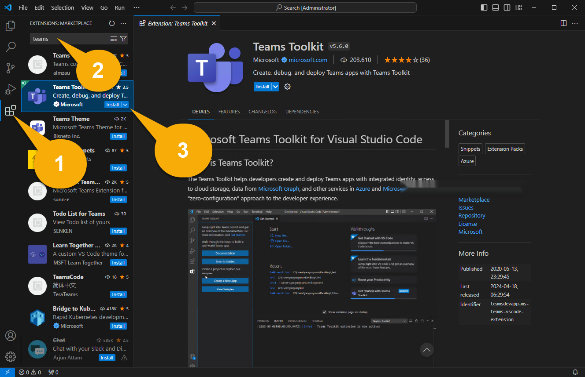

# Building Message Extensions for Microsoft Copilot for Microsoft 365

TABLE OF CONTENTS

* [Welcome](./Exercise%2000%20-%20Welcome.md) 
* [Exercise 1](./Exercise%2001%20-%20Set%20up.md) - Set up your development Environment **(THIS PAGE)**
* [Exercise 2](./Exercise%2003%20-%20Run%20in%20Copilot.md) - Run the sample as a Copilot plugin
* [Exercise 3]() - Add a new command
* [Optional - Code Tour](./Optional%20-%20Code%20tour.md) - Code tour
* [Optional - Message Extension](./Optional%20-%20Run%20sample%20app.md) - Run the sample as a Message Extension

## Exercise 1 - Set up your development environment

## Step 1 - Install prerequisites

**To complete these labs, you will need a login to a Microsoft 365 subscription with permission to upload applications. Your account must also be licensed for Microsoft Copilot for Microsoft 365.**

If you are attending the lab at Build, the workstation already meets these requirements and it includes the following prerequisites.

1. [Visual Studio Code](https://code.visualstudio.com/) (latest version)

2. [NodeJS version 18.x](https://nodejs.org/download/release/v18.18.2/)

3. [Azure Storage Explorer](https://azure.microsoft.com/products/storage/storage-explorer/) (OPTIONAL) - Use it only if you want to view and edit the Northwind database used in this sample

## Step 2 - Reviewing the sample code

You will find the sample code for this lab already downloaded in the **C:\src\msgext-northwind-inventory-ts** folder. This lab will refer to this as your "working folder", since this is where you'll be working.

## Step 3 - Reviewing sample documents to your test user's OneDrive

The sample application includes some documents for Copilot to reference during the labs. In this step, you will check that these files are available on your user's OneDrive so Copilot can find them. Depending on how the tenant is set up, you may be asked to set up multi-factor authentication as part of this process.

Open your browser and browse to the Microsoft 365 portal ([https://www.office.com/](https://www.office.com/)). Log in using the Microsoft 365 account you will be using throughout the lab. You may be asked to set up multi-factor authentication.

Verify that you can find them by entering the word **agreement** in the search box. You should see several contracts that have been placed in SharePoint.

## Step 4 - Install and set up Teams Toolkit for Visual Studio Code

In this step, you'll install the current version of [Teams Toolkit for Visual Studio Code](https://learn.microsoft.com/microsoftteams/platform/toolkit/teams-toolkit-fundamentals?pivots=visual-studio-code-v5). The easiest way to do this is from right inside of Visual Studio Code.

> NOTE: Do not install the pre-release version as it hasn't been tested with this lab

Open your working folder in Visual Studio Code. You may be asked to trust the authors of this folder; if so, please do.

In the left sidebar, select the Extensions icon1️⃣. Enter the word "teams" into the search box 2️⃣ and locate "Teams Toolkit" in the search results. Click "Install" 3️⃣.

Now select the Teams Toolkit icon in the left 1️⃣ . If it offers options to create a new project, you're probably in the wrong folder. In the Visual Studio Code file menu select "Open Folder" and directly open the **msgext-northwind-inventory-ts** folder. You should see sections for Accounts, Environment, etc. as shown below.

Under "Accounts" click "Sign in to Microsoft 365"2️⃣ and log in with the Microsoft 365 account provided by the lab instructors. 

A browser window will pop up and offer to log into Microsoft 365. When it says "You are signed in now and close this page", please do so.

Now verify that the "Sideloading enabled" checker has a green checkmark. If it doesn't, that means that your user account doesn't have permission to upload Teams applications. This permission is turned on in the lab environment. If you want to learn how you can turn it on your own tenant, here are [instructions for enabling users to upload custom apps](https://learn.microsoft.com/microsoftteams/teams-custom-app-policies-and-settings#allow-users-to-upload-custom-apps)

## Congratulations

You have completed Exercise 1.
Please proceed to [Exercise 2](./Exercise%2002%20-%20Run%20in%20Copilot.md) in which you will run the sample application as a Copilot for Microsoft 365 plugin.

